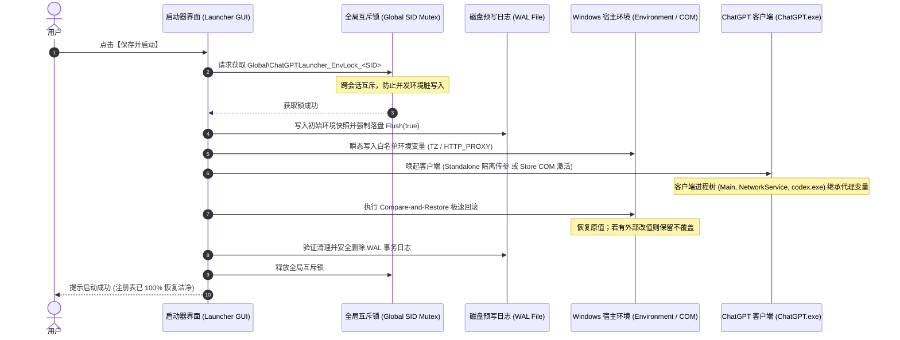

# ChatGPT Windows 网络环境启动器 (ChatGPT Windows Network Launcher)

<p align="center">
  <a href="README.md"><b>简体中文</b></a> | <a href="README_EN.md"><b>English</b></a>
</p>

<p align="center">
  
  
  
  
  
  
</p>

---

## 📖 项目简介与设计初衷 (Overview & Problem Statement)

**ChatGPT Windows Network Launcher** 是一款专为 Windows 平台 ChatGPT 桌面客户端（全面兼容微软应用商店版 `OpenAI.Codex` 与独立桌面版）深度定制的原生桌面网络环境辅助启动器。

### 痛点背景
Windows 官方 ChatGPT 客户端在底层基于 Chromium/Electron 架构构建，但**未在前端界面中提供任何网络代理或连接配置选项**：
- **频繁断连与超时**：在复杂的网络环境下，客户端极易陷入 `Reconnecting...`、连线超时或白屏卡顿；
- **全局代理副作用大**：传统的解决方案通常要求用户开启 VPN 全局接管或 TUN/TAP 虚拟网卡模式，这会强行劫持整台电脑的所有网络流量，导致国内应用访问降速或局域网服务中断；
- **时区与出口 IP 冲突**：系统本地时区与代理出口节点时区严重偏差（例如出口在日本东京 UTC+9，而客户端上报本地系统时间为 UTC+8），可能触发客户端多维度的异常检测。

### 本项目的解决方案
本项目提供**进程级环境变量精准注入**、**毫秒级预写式日志事务 (WAL) 回滚**与**权威出口时区比对**，让 ChatGPT 客户端在独享本地代理通道的同时，**对 Windows 全局系统时区、系统代理与其他软件实现 100% 零污染与零侵入**。

---

## 🚀 快速上手 (Quick Start)

### 方式一：直接运行已发布的可执行文件 (30 秒上手)
1. 前往本项目的 [Releases 页面](../../releases) 下载最新的 `ChatGPTAntiBanLauncher.exe`（仅几十 KB，纯绿色免安装）；
2. 双击运行程序；
3. 选择本地代理模式并确认端口（如 Clash 填写 `7897`，v2rayN 填写 `7890`）；
4. 点击【🔍 检测当前节点】，确认出口正常后点击【⚡ 一键匹配该时区】；
5. 点击【🚀 保存并启动】即可无缝唤起客户端；
6. （可选）点击【📌 创建桌面快捷方式】，日后可直接从桌面一键启动。

### 方式二：命令行无头启动 (Headless Mode)
本程序支持命令行参数，便于集成至脚本、开机自启或快捷启动流：
```cmd
REM 直接使用已保存的配置无头拉起客户端
ChatGPTAntiBanLauncher.exe --launch

REM 查看命令行帮助
ChatGPTAntiBanLauncher.exe --help
```

---

## ✨ 核心特性 (Key Features)

### 1. 🟢 双模式网络代理配置
- **本地代理模式**：精准注入 `HTTP_PROXY`、`HTTPS_PROXY`、`ALL_PROXY`、`NO_PROXY` 环境变量；
- **显式直连模式**：主动清除可能从父进程或系统环境继承的脏代理变量，确保干净直连；
- **常用端口预设**：一键快速切换 `7897 (Clash Verge / Mihomo)`、`7890 (v2rayN)`、`10808 (Xray)`、`1080 (Shadowsocks)`，并支持本地 Socket 存活探测；
- **严格前置校验**：输入端口合法性（1~65535）严格阻断检查，拒绝静默错误。

### 2. 🕒 目标时区配置与 V8 引擎底层适配
- 支持标准 IANA 城市时区（如 `America/Los_Angeles`、`Asia/Tokyo`）及精确 UTC 偏移；
- **V8 引擎 POSIX 转换**：自动将整数 UTC 偏移转换为 POSIX 规范的 `Etc/GMT` 格式，规避 V8/Chromium 在 Windows 下将非标准 `UTC-X` 误判为 `Etc/Unknown` 的缺陷；
- **严格免夏令时 (Non-DST) 约束**：仅允许具备永久固定免夏令时对应的偏移（如 Kathmandu +5:45、Kolkata +5:30、Darwin +9:30）；对存在夏令时跳变且不可靠的偏移（如 Newfoundland -3:30）明确拒绝并阻断，严禁不可靠的静默回退；
- **时区伪装开关**：提供“关闭时区伪装”选项，仅注入网络代理而不干涉系统时间。

### 3. 🔍 权威 HTTPS 出口节点感知与防风控比对
- 移除所有明文 HTTP 接口，全流程采用权威 HTTPS GeoIP 接口；
- **严格 TLS 证书链验证**：显式启用 TLS 1.2+ 协议协商，坚决杜绝无条件信任证书的漏洞；
- 准确分类证书异常、代理不可达、超时与 HTTP 状态码；
- 客观比对当前选择时区与节点实际出口时区，提供【⚡ 一键匹配该时区】功能。

### 4. ⚡ 环境预写日志事务 (WAL) 与 Compare-and-Restore
- **受信任白名单机制**：仅允许管理 5 个核心白名单环境变量（`TZ`、`HTTP_PROXY`、`HTTPS_PROXY`、`ALL_PROXY`、`NO_PROXY`），杜绝越权污染；
- **跨会话互斥保障**：基于当前用户安全标识符构造全局互斥体（`Global\ChatGPTLauncher_EnvLock_<UserSID>`），禁止静默降级为 Local 锁；
- **Compare-and-Restore 防外部冲突**：环境恢复阶段若检测到变量已被外部程序修改，严格保留当前外部配置不覆盖，向 UI 输出琥珀色告警并隐藏敏感凭据；
- **启动自愈与瞬态回滚**：客户端成功唤起后毫秒级内完成环境清理，注册表零污染残留。

### 5. 🛡️ 进程精准核验与优雅退出防护
- 严格全路径与目录边界核验，拒绝匹配 `ChatGPT-other` 等相似前缀目录中的进程；
- 启动前优先调用 `CloseMainWindow()` 进行优雅退出；超时后必须获得显式确认回调才执行强退，杜绝盲杀进程导致未保存的草稿丢失。

### 6. 🪶 轻量原生构建与安全原子配置
- 纯原生 C# WinForms 开发，编译后为单个独立 `.exe` 文件（仅几十 KB），绿色便携免安装；
- 配置文件落盘采用安全原子替换（Safe Atomic Replace）：目标文件被占用时 100% 保留原配置，绝不回退删除目标；
- 支持一键在桌面生成专属启动快捷方式。

---

## 📊 方案对比 (Comparison)

| 维度 | 系统全局 TUN / TAP 模式 | 手动批处理脚本 (.bat) | 本项目 (ChatGPT Network Launcher) |
| :--- | :---: | :---: | :---: |
| **代理作用域** | ❌ 强行劫持整机所有软件 | ⚠️ 仅子进程生效，易遗留环境 | 🟢 **仅对 ChatGPT 进程精准注入** |
| **系统环境污染** | ❌ 劫持全局路由表/虚拟网卡 | ❌ 容易残留脏变量或写死注册表 | 🟢 **100% 零残留 (WAL 毫秒级回滚)** |
| **并发与冲突保护** | ➖ 无 | ❌ 并发修改相互覆盖 | 🟢 **基于用户 SID 的全局互斥锁** |
| **外部配置保护** | ➖ 无 | ❌ 暴力覆盖外部已有配置 | 🟢 **Compare-and-Restore 智能保留** |
| **出口节点感知** | ❌ 无 | ❌ 无 | 🟢 **权威 HTTPS 探测与一键时区对齐** |
| **时区引擎适配** | ❌ 需修改系统整机时钟 | ⚠️ 简单传参易致 V8 引擎解析失败 | 🟢 **严格 POSIX 规范与免夏令时保护** |
| **运行依赖** | 需安装虚拟网卡驱动 | 无 | 🟢 **纯原生 C#，零安装零依赖** |

---

## 🏗️ 工作原理与架构时序 (Architecture)



---

## 🖥️ 系统与运行要求 (Requirements)

- **支持系统**：Windows 10 / Windows 11 (64-bit)
- **依赖框架**：.NET Framework 4.5 及以上（**Windows 10/11 操作系统默认已内置，无需额外安装任何运行库**）
- **客户端支持**：
  - 微软应用商店版（Microsoft Store `OpenAI.Codex`）
  - 独立桌面版（Standalone Desktop Installer）

---

## 🛠️ 本地编译与测试 (Build & Test)

本项目无需安装 Node.js、Python、Visual Studio 或庞大的 .NET 8 SDK，直接利用 Windows 系统内置的 `csc.exe` 即可秒级编译：

### 1. 仅编译 (Build Only)
双击运行 `compile.bat` 或在命令行执行：
```cmd
compile.bat
```
或：
```cmd
build.bat /build-only
```
编译成功后将在项目根目录下生成 `ChatGPTAntiBanLauncher.exe`。

### 2. 编译并直接启动
双击运行 `build.bat`，脚本将自动完成编译并拉起启动器界面。

### 3. 运行自动化全套隔离测试套件
在独立沙箱目录中执行 3 套完整的单元与防御测试（覆盖跨会话互斥、WAL 恢复、原子保存、时区 POSIX 校验等）：
```cmd
run_tests.bat
```
> **测试结果**：162 项防御测试 + 45 项组件测试 + 5 项事务测试，共 **212 项自动化断言 100% 通过**。测试全程不修改真实系统注册表，不干扰运行中的真实客户端。

---

## 🔬 深度技术与验收报告 (Technical Reports)

为了让技术实现完全经得起社区推敲，我们提供了详尽的实测与工程验证报告：

- 📄 **[L4 级真实客户端实机实测验收报告 (REAL_CLIENT_ACCEPTANCE_REPORT.md)](docs/reports/REAL_CLIENT_ACCEPTANCE_REPORT.md)**：
  - 包含对运行中 64 位 ChatGPT 进程树 PEB 环境块提取的直接证据；
  - 证实核心网络服务进程 (`NetworkService`) 与后端应用进程 (`codex.exe`) 向本地代理建立了活跃连接，出向流量 **100% 走代理转发**，直连公网连接数为 0。
- 📄 **[v0.5 工程验证与测试报告 (VALIDATION_REPORT_V0_5.md)](docs/reports/VALIDATION_REPORT_V0_5.md)**：
  - 记录 212 项自动化断言的测试方法与覆盖边界。
- 📄 **[项目记忆全量知识库 (PROJECT_MEMORY.md)](docs/dev/PROJECT_MEMORY.md)**：
  - 记录高 DPI 界面缩放适配、Windows 批处理字符漂移规避、多命名空间冲突治理等关键踩坑实录。

---

## ❓ 常见问题 (FAQ & Troubleshooting)

<details>
<summary><b>Q1: 杀毒软件或 Windows Defender 是否会报毒？</b></summary>
<br>
本程序为纯净的原生 C# 开源项目，由 Windows 自带的 <code>csc.exe</code> 编译生成，且未向微软购买昂贵的商业数字签名证书。部分杀毒软件对未签名的轻量启动器类可执行文件可能会产生启发式误报。
<br><br>
<b>解决方案</b>：项目所有源码均在仓库中完全公开，你可以通过查看源码后自行运行 <code>compile.bat</code> 本地编译，绝对安全可信。
</details>

<details>
<summary><b>Q2: 为什么商店版 ChatGPT 打开后，网页界面的聊天时间依然是本地电脑时间？</b></summary>
<br>
根据我们在 <a href="docs/reports/REAL_CLIENT_ACCEPTANCE_REPORT.md">L4 级实机测试</a> 中的深度分析：
<ol>
  <li>Chromium 内核出于安全沙箱隔离考虑，在派生前端 <code>--type=renderer</code> 页面进程时，主动执行了 <code>clear_environment = true</code>，剥离了非系统变量；</li>
  <li>在 Windows 平台上，Chromium 前端 DOM 优先通过 Win32 API 查询系统底层时钟，而非采纳 POSIX <code>TZ</code> 变量；</li>
  <li><b>但这不影响网络核心</b>：所有对外网络请求均由 <code>NetworkService</code> 和后端 <code>codex.exe</code> 负责，这两大核心进程均已成功注入代理与时区环境变量，所有流量均经代理正常转发。</li>
</ol>
</details>

<details>
<summary><b>Q3: 关闭启动器后，我的系统时区或系统网络会被改变吗？</b></summary>
<br>
<b>绝对不会。</b> 本项目的一大核心设计原则就是“零系统污染”。启动器在拉起客户端后，会在数毫秒内通过预写日志机制将环境变量精确回滚至启动前的原始状态，系统全局时区和网络配置从未被篡改。
</details>

---

## 🔒 安全与合规免责声明 (Security & Disclaimer)

1. **非官方从属声明**：本项目为独立的第三方开源网络环境辅助工具，**与 OpenAI、ChatGPT 或 Microsoft 无任何官方隶属、认可、赞助或合作关系**。"ChatGPT" 商标归 OpenAI 及其母公司所有；
2. **非侵入式承诺**：本项目严格遵循操作系统公开接口规范，**绝不包含**内存 Hook、代码注入、解密劫持、修改客户端原生文件等违规逆向行为；
3. **隐私安全承诺**：程序不包含任何后台遥测 (Telemetry)、统计代码或凭证窃取逻辑；
4. **免责条款**：用户在使用本项目时应自行遵守所在地区的相关法律法规及 OpenAI 的服务条款 (ToS)。因用户自身网络环境、账号使用不当导致的任何异常，本项目及开发者不承担连带法律责任。

---

## 📄 开源许可证 (License)

本项目遵循 [MIT 许可证](LICENSE) 开源。欢迎自由使用、分发、修改与商业集成。
