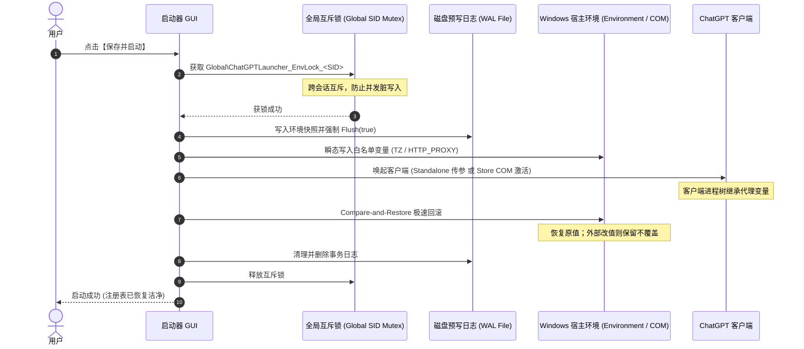

# ChatGPT Windows 网络环境启动器 (ChatGPT Windows Network Launcher)

  <a href="README.md"><b>简体中文</b></a> | <a href="README_EN.md"><b>English</b></a>

  
  
  
  
  
  

---

## 📖 简介 (Overview)

专为 Windows ChatGPT 桌面客户端（微软商店版 `OpenAI.Codex` 与独立桌面版）定制的原生网络环境启动器。官方客户端基于 Chromium/Electron，但界面不提供任何代理配置，复杂网络下易出现断连、超时，且需要全局 VPN 或 TUN 劫持整机遇流量与环境。本项目通过**进程级环境变量精准注入** + **毫秒级 WAL 事务回滚** + **权威出口时区比对**，让 ChatGPT 独享代理通道，同时**对系统时区、系统代理零污染零侵入**。

---

## 🚀 快速上手 (Quick Start)

1. 从 [Releases](../../releases) 下载 `ChatGPTAntiBanLauncher.exe`（绿免，几十 KB）；
2. 启动后选择【本地代理模式】并确认端口（Clash `7897` / v2rayN `7890`）；
3. 点击【检测公网出口】确认节点，再点【采用该节点时区】对齐时区；
4. 点【保存并启动】唤起客户端；（可选）建【桌面快捷方式】一键启动。

**无头模式**：`ChatGPTAntiBanLauncher.exe --launch`（按已存配置直接拉起）、`--help`（帮助）。

---

## ✨ 核心特性 (Key Features)

- **🟢 双模式代理**：本地代理模式注入 `HTTP_PROXY` 等 4 项变量；显式直连模式清除继承的脏代理变量。内置端口预设（7897/7890/10808/1080）与 Socket 存活探测、端口合法性校验。
- **🕒 时区配置**：支持 IANA 城市时区与 UTC 偏移；自动转 POSIX `Etc/GMT`，规避 Chromium V8 解析 `UTC-X` 的缺陷；严格拒绝带夏令时跳变的不可靠偏移，可一键「关闭时区伪装」。
- **🔍 出口节点感知**：全 HTTPS GeoIP + 严格 TLS 1.2+ 校验，客观比对所选时区与节点出口时区，提供一键对齐。
- **⚡ WAL 事务与 Compare-and-Restore**：仅操作 5 个白名单变量；基于用户 SID 的全局互斥锁防并发；回滚时检测到外部修改则保留不覆盖并琥珀色告警；拉起后毫秒级清理、注册表零残留。
- **🛡️ 进程防护**：严格规范路径/目录边界核验，优先 `CloseMainWindow()` 优雅退出，无显式授权拒绝强杀。
- **🪶 轻量构建**：纯原生 C# WinForms，单 `.exe`（几十 KB）免安装；配置原子落盘（占用时 100% 保留原档）。
- **🎨 现代化 UI**：亮色/深色主题一键切换并可随系统持久化（`theme_mode`）；圆角卡片 + 图标体系 + 状态动效；可折叠日志栏；高 DPI 下按钮文字自动适配不截断。

---

## 📊 与常见方案对比 (Comparison)

| 维度 | 系统全局 TUN / TAP | 手动批处理脚本 (.bat) | 本项目 |
| :--- | :---: | :---: | :---: |
| **代理作用域** | ❌ 劫持整机 | ⚠️ 仅子进程、易遗留 | 🟢 **仅精准注入 ChatGPT** |
| **系统环境污染** | ❌ 劫持路由表/虚拟网卡 | ❌ 易残留脏变量 | 🟢 **零残留 (WAL 毫秒回滚)** |
| **冲突保护** | ➖ 无 | ❌ 并发互相覆盖 | 🟢 **用户 SID 全局互斥锁** |
| **出口节点感知** | ❌ 无 | ❌ 无 | 🟢 **HTTPS 探测 + 一键时区对齐** |
| **时区引擎适配** | ❌ 改整机时钟 | ⚠️ 易致 V8 解析失败 | 🟢 **POSIX 规范 + 免夏令时保护** |
| **运行依赖** | 需虚拟网卡驱动 | 无 | 🟢 **纯原生，零安装零依赖** |

---

## 🏗️ 工作原理 (Architecture)

---

## 🖥️ 系统要求 (Requirements)

Windows 10/11 (64-bit)，依赖内置的 .NET Framework 4.5+（**无需安装任何运行库**）。支持商店版 `OpenAI.Codex` 与独立桌面版。

---

## 🛠️ 编译与测试 (Build & Test)

依赖系统自带 `csc.exe`，无需 Node/Visual Studio/.NET SDK：

- **仅编译**：`compile.bat` → 生成 `ChatGPTAntiBanLauncher.exe`；`build.bat` 会编译并直接启动。
- **全部测试**：`run_tests.bat`，3 套隔离测试共 **212 项断言 100% 通过**（覆盖互斥锁、WAL 恢复、原子保存、时区 POSIX 校验等，不触碰真实注册表）。

---

## 🔬 技术报告 (Technical Reports)

- 📄 [L4 实机验收报告](docs/reports/REAL_CLIENT_ACCEPTANCE_REPORT.md) — PEB 环境块证据，证实出向流量 100% 走代理、直连为 0。
- 📄 [v0.5 验证报告](docs/reports/VALIDATION_REPORT_V0_5.md) — 212 项断言的测试方法与覆盖边界。
- 📄 [项目记忆知识库](docs/dev/PROJECT_MEMORY.md) — 高 DPI 适配、批处理字符漂移等踩坑实录。

---

## ❓ 常见问题 (FAQ)

<b>Q1：杀软/Windows Defender 会误报吗？</b>

程序是纯原生、开源的，用系统自带 `csc.exe` 编译，未购买商业签名证书，部分杀软可能对未签名的轻量启动器启发式误报。可自行查看源码后本地 `compile.bat` 编译运行，绝对可信。

<b>Q2：商店版打开后网页聊天时间仍是本地时间？</b>

Chromium 出于沙箱安全，渲染进程会 `clear_environment` 剥离非系统变量，且前端 DOM 优先读系统时钟而非 `TZ`。**但这不影响网络核心**：流量由已成功注入代理/时区的 `NetworkService` 与 `codex.exe` 转发。

<b>Q3：关闭启动器后系统时区/网络会被改变吗？</b>

**不会。** 核心设计是「零系统污染」：拉起客户端后数毫秒内经 WAL 机制精确回滚至原始状态，系统时区与网络从未被篡改。

---

## 🔒 声明 (Disclaimer)

本项目为独立第三方工具，与 OpenAI / Microsoft **无任何官方隶属关系**；不使用内存 Hook、代码注入等违规逆向手段；无任何遥测与统计代码。用户应自行遵守当地法规与 OpenAI 服务条款，因自身网络或账号使用不当导致的异常，本项目不承担连带责任。

---

## 📄 许可证 (License)

[MIT 许可证](LICENSE)